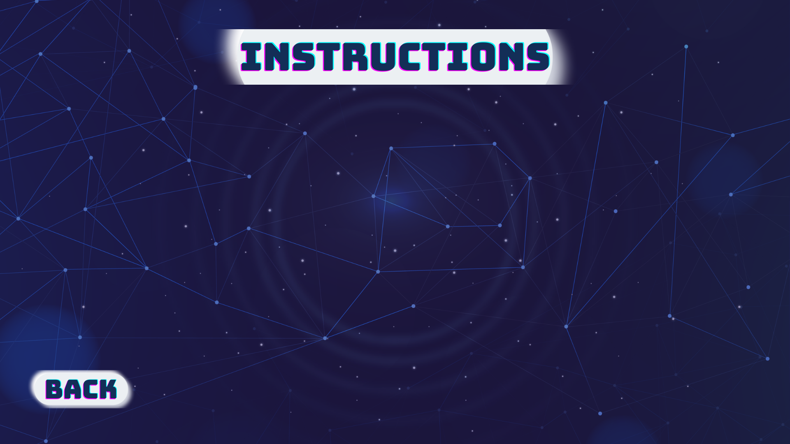

# Need for Speed - Space Shooter Game

This is a simple game consisting of 2 levels made as the final project for the Object Oriented Programming course.
The game is written in C++ with the help of the built-in SDL library.

## Synopsis
JSS’s Explorer 13 mission to investigate the newly discovered Exo Planet LP 890-9 c.

It was reported that this planet has special air which has diamonds in it. Hence, our astronauts decided to
land on the planet and get the treasure. As they reached there, to their surprise, they got attacked! It seems
that the planet is already inhabited by species unknown to mankind! Aliens!

As the aliens start closing in, the astronauts run towards safety and take off, however with the advanced
technology of the aliens, they are able to catch up with the spaceship too soon. Unarmed all our astronauts
can do is defend themselves, so help them reach home, but they can’t go out of this planet without at least
10 diamonds collected, if they do, they will lose the mission.

Their spaceship has a backup engine hence, they have two chances. They are being attacked by canon on
while escaping the planet, each canon attack decreases the health of their spacecraft by 10 points so they
have to save themselves from getting attacked, in order to keep the health of their spacecraft up. So help
them reach home by maneuvering them through the attacks.

Once they got out of this planet, with 10 or more diamonds, and at least 1 engine, they are reported by
their team that a neighbor planet is totally safe and have diamonds too, hence they change their course
and land on that planet.

Unfortunately, they were reported wrong. To their shock, as they entered this planet, they encountered
more dangerous aliens, who busted them with two type of attacks, canon and laser, and each laser attack
decreases their health by 20 points. It would take 3 minutes for their spaceship to get out of this planet, if
they are able to escape before their spaceship expires, they are safe, and mission is successful, however, if
their spaceship dies off due to attacks, the mission is unsuccessful.

There is no limit of diamonds to be collected before leaving this planet, hence if they are successful in
escaping then the mission is successful.

## UML Diagram

## Screenshots
### The Menu Page:

### Rules Page:

