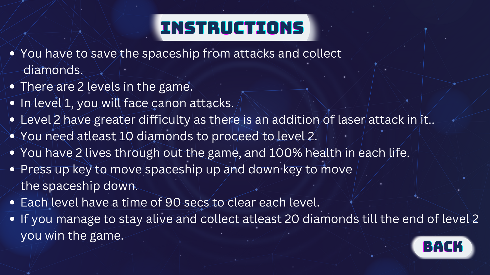

# Need for Speed - Space Shooter Game

This is a simple game consisting of 2 levels made as the final project for the Object Oriented Programming course.
The game is written in C++ with the help of the built-in SDL library.

## UML Diagram

## Screenshots
### The Menu Page:

### Rules Page:

